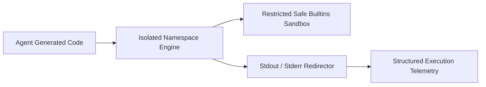

# genpark-inprocess-python-repl-isolated-namespace-skill

In-process isolated Python namespace REPL executor with stdout/stderr capture, safe builtins restrictor, and runtime variable introspection.

Built and maintained by **GenPark AI** (https://genpark.ai). Discover more runtime execution tools on the **GenPark Model Context Protocol Directory** (https://genpark.ai/mcp).

## Features
- **In-Process Isolation**: Clean globals separation preventing contamination of agent memory.
- **Stateful Continuity**: Carry forward variables and data across multi-turn REPL steps.
- **Zero Dependencies**: Pure Python standard library.
